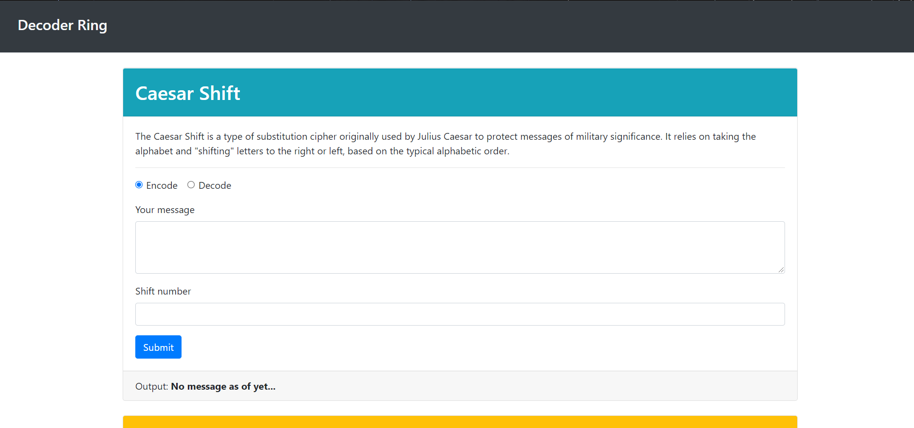

# decoder-ring

Fun school project in which I created a website that allows users to code/decode secret messages using a variety of techniques.

In this project I demonstrated:
* my ability to think critically and logically write complex functions that manipulate strings and numbers.
* used Advanced functions and ES6 to write clearly and concisely.
* demonstrated my ability to research independently by using new tools not yet shown to me through the program.
* created a fun and flexible website that friends continue to enjoy.

